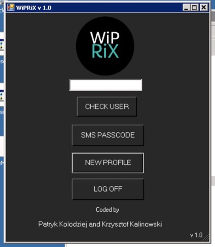

# Scripts_automation
<h3>Repo with my scripts created for some automation tasks</h3>

  <label>This repository contains some exemplary scripts I created to automate some tasks.
    All of the scripts uploaded to this repo are currently in use and are <b>meant for the prod env</b>, yet all of the <b>sensitive information has been replaced</b> with comments that indicate the actual content.</label>
    

 
List of scripts: 

<ol>
  <li><b>DeleteInactiveUsers</b>  
    Script created to automate deleting of deactivated AD users that have been placed in a specific OU 30 days after last edit. Created as an implementation of a 30 days deletion policy of a customer, running on a daily basis.  
    In ver. 1.1 some minor fixes plus  fuctionality of sending the generated log file to admin emailaddress.
      
  </li> 
  <li><b>Onboarding_Brukeropprettelse</b>  
    Onboarding script used to create users in on prem AD and assign some basic access groups. Future releases will coordinate further steps with license/group and role assignment in O365/AzureAD. Based on a csv file exported from the system of the HR department script is creating a an AD user, email address, providing basic access and sending a notification by email to the manager and HR department.
  </li> 
  <li><b>AzureLicense</b>  
    Supplementing script for the Onboarding_Brukeropprettelse - script is first validating if there are any users in on-prem AD that can be synced with Azure, so checking if users are already synced, and if they are - users are getting assigned a license/group based on the "Position" value from on-prem AD. If users are not found in AzureAD - script is pending 20 mins and calling recursively some of its cmdlets again, checking till all of the given users are processed successfully. (AzureAD-OnpremAD hourly sync scenario).
  </li> 
  <li><b>WipRix</b>  
    A PowerShell based administrative application with a full GUI automating the daily repetitive tasks of Citrix administration. Created for internal ServiceDesk use as a team work, Wiprix will check if user is logged in, what kind of sessions are running, on which servers, can also LOG OFF the user from all sessions, create a new citrix profile and add user to SMS passcode group - each of those tasks with just a single mouse click. It helped SD agenst to increase the performance of basic troubleshooting and solving most common Citrix-related issues. App has also its own special design.
      
    In future releases it will also help SD agents coordinate onpremAD management with AzureAD management, simplifying basic tasks even further and allowing to use a single tool to sort all of the issues now spread over many separate tools.
       
    
  </li> 
  <li><b>AddAD</b>  
    GUI version for Entur user creation and basic management with some additional features   
Upgraded version utilizing parts of script Onboarding_Brukeropprettelse.ps1 created by Krzysztof Kalinowski and Patryk Kolodziej  
Functionalities: 
    - Authenticates users through AzureAD 
    - creates Users in AD with given input 
    - User creation possible both manually by typing the necessary values or semi-automated by providing the xlsx file that is valid with the schema.
	Two xlsx parsing modes: for single user creation and for batch creation (one sheet per user within the input file). 
    - sends email to HR and manager post creation - if user chooses to 
    - after successful sync - we can check status of Azure AD and get all Licenses and Azure Groups user is member of 
    - Can add MFA Azure access for the user if existent in AzureAD and an access group responsible for E3 license 
    - Exception handling OFC... 
    - All served in a User-friendly GUI 
   
    
  </li> 
  </ol>
